Section 1 - Introduction
===

## Information
- Title:  `JavaScript - The Complete Guide 2024 (Beginner + Advanced)`
- Authors:  `Etienne KOA`

## Qu'est-ce que JavaScript ?

+ `JavaScript` est un langage de programmation `dynamique, faiblement typé, compilé au moment de l'exécution`. Il peut être exécuté dans le cadre d’une page Web dans un navigateur ou directement sur n’importe quelle machine (« environnement hôte »).

+ **`JavaScript` a été créé pour rendre les pages Web plus dynamiques (par exemple, modifier le contenu d'une page directement depuis le navigateur). À l'origine, il s'appelait `LiveScript`, mais en raison de la popularité de Java, il a été renommé `JavaScript`.**

+ **`JavaScript` est totalement indépendant de Java et n'a rien de commun avec Java !**

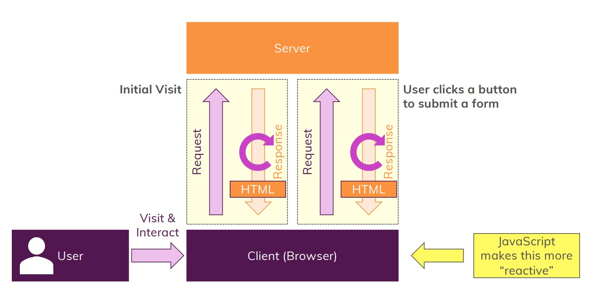

+ **Savez-vous maintenant ce qu'est Javascript ? Est-ce dynamique, faiblement typé compilé au moment de l'exécution rend les pages Web plus dynamiques ? Comment fonctionnent les pages Web ?** 

+ **Vous êtes l'utilisateur qui visite une page Web et lorsque vous visitez une page Web, vous utilisez un navigateur pour cela. Vous utilisez votre client, votre machine, votre ordinateur portable, où vous avez un navigateur installé dessus, vous entrez une `URL` ou cliquez sur un résultat de recherche sur Google et la page Web se charge.** 

+ **Pour être précis lorsque vous visitez initialement une page Web, une demande est envoyée au serveur, donc à un ordinateur sur Internet où cette page Web, où le fichier `HTML` est hébergé et ce serveur charge ensuite cette page Web et la renvoie à votre navigateur dans une soi-disant réponse et la
forme de réponse la plus basique que nous connaissons ou que nous voyons et utilisons
généralement lorsque nous travaillons avec Internet, lorsque nous visitons une page est simplement une page HTML qui est renvoyée par le serveur au client.**

+ **Disons maintenant que sur cette page Web chargée, disons que c'est une boutique en ligne, cela n'a pas vraiment d'importance, l'utilisateur clique sur un bouton pour soumettre un formulaire, par exemple pour commander des produits.**

+ **Maintenant, cela déclenchera alors une nouvelle demande qui sera envoyée par le navigateur au serveur pour envoyer cette soumission de formulaire au serveur et le serveur gérera la demande entrante, stockera peut-être certaines données de commande dans une base de données et une fois cela fait, il répondra retour avec une nouvelle réponse, avec une nouvelle page web, un nouveau document `HTML` qui est renvoyé au client, peut-être la page de confirmation de commande.** 

+ **C'est donc ainsi que nous interagissons avec le Web, c'est ainsi que fonctionnent traditionnellement les pages Web.**

+ **Maintenant, `Javascript` nous aide à rendre cela plus réactif, il nous aide à rendre une page Web plus réactive et à ignorer ce deuxième flux de réponse de demande dans certaines circonstances pour
modifier à la place la page déjà chargée et y faire quelque chose.**

## JavaScript In Action!

+ Si nous revenons à cette question de ce qu'est `JavaScript`.

+ `JavaScript` est un langage de programmation dynamique faiblement typé.

+ C'est un langage interprété, ce qui signifie qu'il est compilé à la volée. Il est compilé avant de s'exécuter et n'est pas compilé pendant le développement.

+ Comme certains autres langages de programmation, il s'agit d'un langage hébergé
qui s'exécute dans différents environnements.

+ Alors maintenant, nous comprenons pourquoi nous utilisons JavaScript et ce qu'il nous permet de faire, mais à quoi servent ces tours ?

  + Dynamique faiblement typée et interprétée.
  + Langage hébergé qui s'exécute dans différents environnements (par exemple dans un navigateur).
  + Interprété à la volée en langage compilé.
  + Cas d'utilisation le plus important : exécuter du code dans un navigateur (sur une page Web).

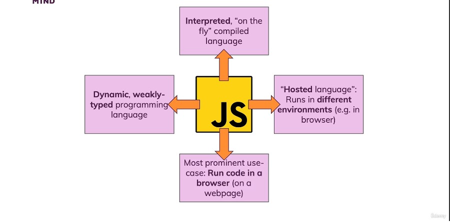

## How JavaScript Is Executed

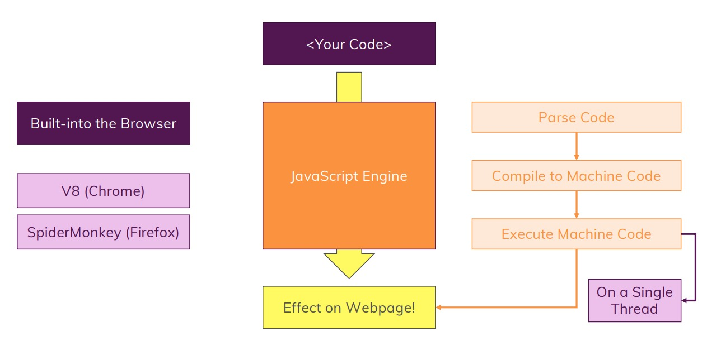

## Dynamic vs Weakly Typed Languages

|Dynamic? |+ |Weakly Typed?|
|---------|---|-------------|
|Langage de programmation dynamique et interprété.||Langage de programmation faiblement typé.|
|Non précompilé, mais analysé et compilé « à la volée » (par exemple dans le navigateur).||Les types de données sont automatiquement pris en compte (par exemple attribués aux variables)|
|Code évalué et exécuté au moment de l'exécution.||Vous ne définissez pas qu'une variable doit contenir une certaine valeur (par exemple un nombre).|
|Le code peut changer au moment de l'exécution (par exemple, le type d'une variable).||Les types de données ne sont pas gravés dans le marbre mais peuvent changer.|

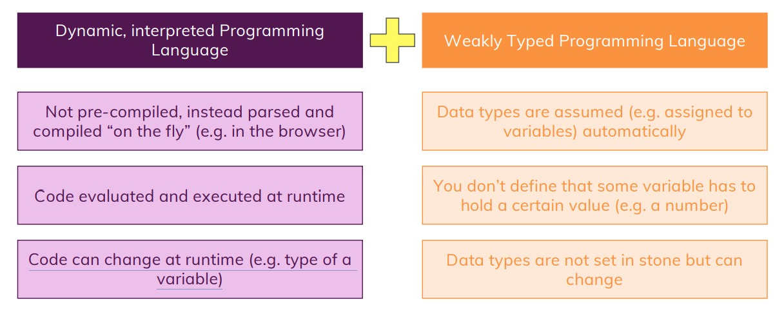

## JavaScript Executes In A Hosted Environment

|Côté navigateur| "Autre" (par exemple côté serveur) |
|------------|--------------------------------|
|`JavaScript` a été inventé pour créer des sites Web plus dynamiques en s'exécutant dans le navigateur|`Le moteur JavaScript de Google (V8)` a été extrait pour exécuter `JavaScript` n'importe où (appelé `Node.js`)|
|`JavaScript` peut manipuler le code `HTML`, `CSS`, envoyer des `Requêtes HTTP` en arrière-plan et bien plus encore.|`Node.js` peut être extrait sur n'importe quelle machine et est donc souvent utilisé pour créer des backends Web (serveur- côté JavaScript).|
|`JavaScript NE PEUT PAS` accéder au système de fichiers local, interagir avec le système d'exploitation, etc. |`Node.js PEUT` accéder au système de fichiers local, interagir avec le système d'exploitation, etc. Il NE PEUT PAS manipuler `HTML` ou `CSS` .|

 

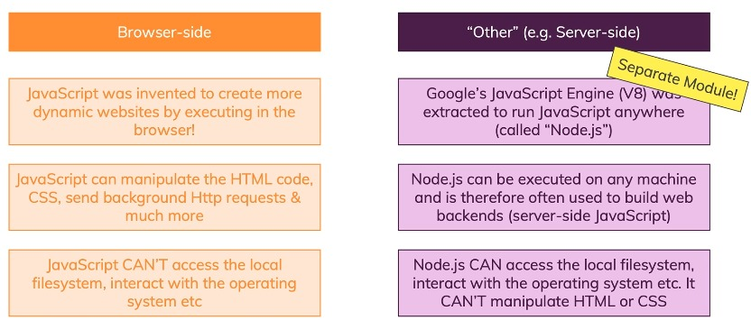

## Course Outline - What's In This Course ?

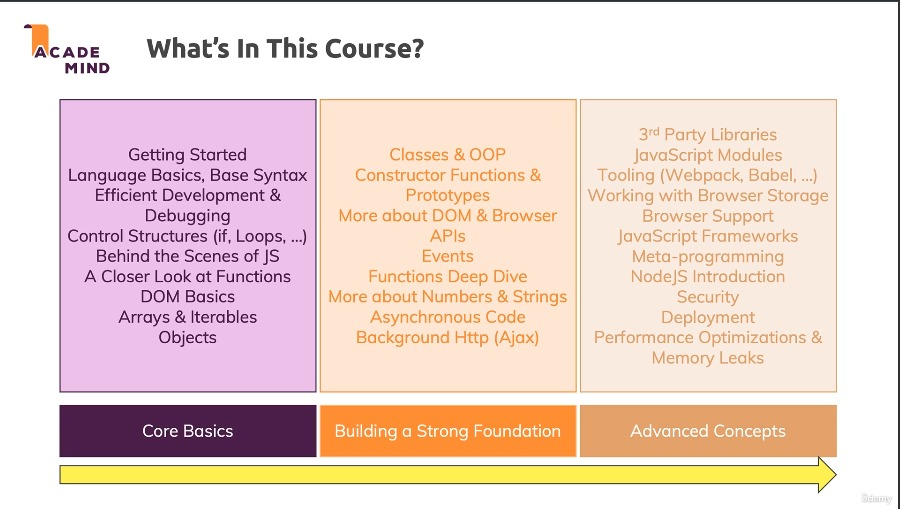

## How To Get The Most Out Of This Course

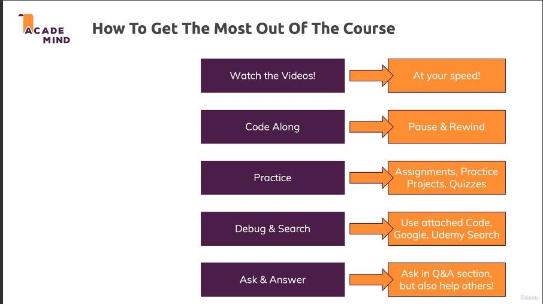

## JavaScript vs Java

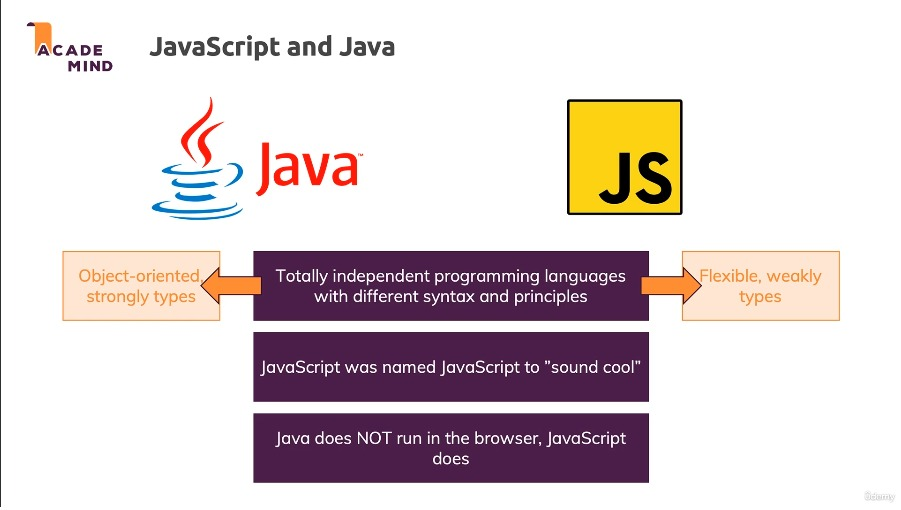

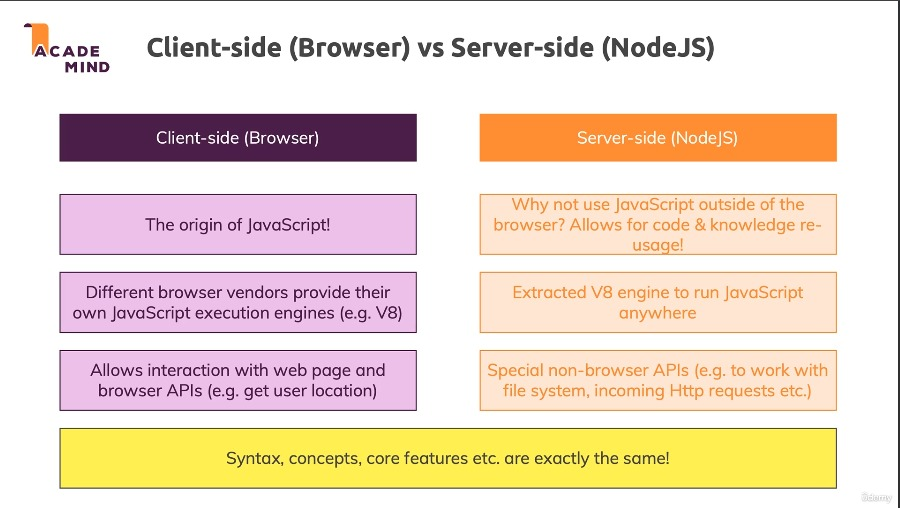

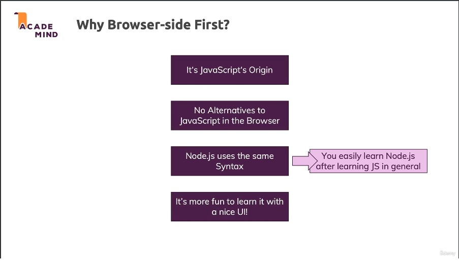

## A Brief History Of JavaScript 

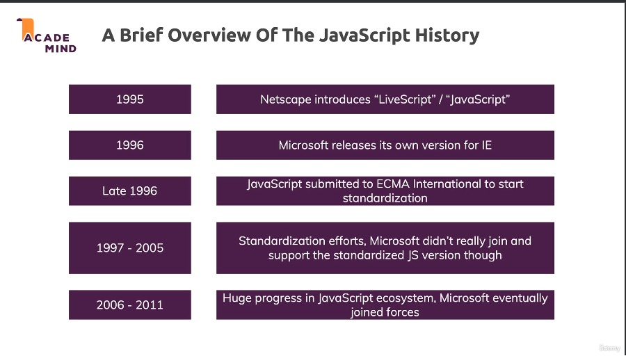

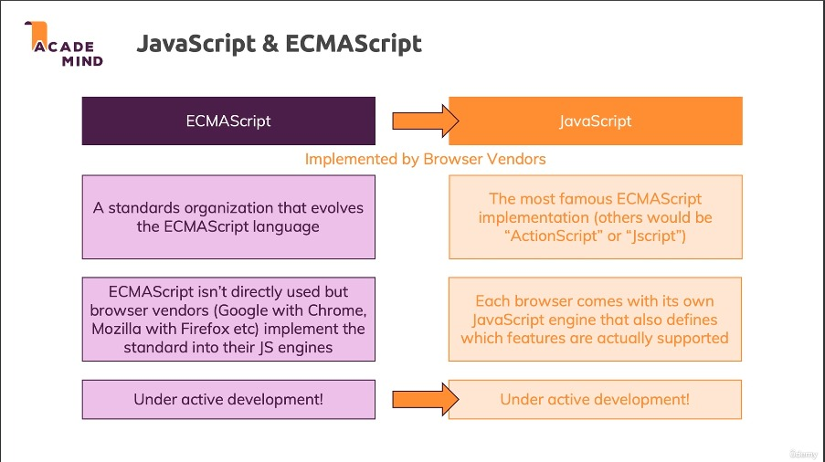

## A Setting Up a Development Environment

+ [Visual Studio Code](https://code.visualstudio.com/download)

