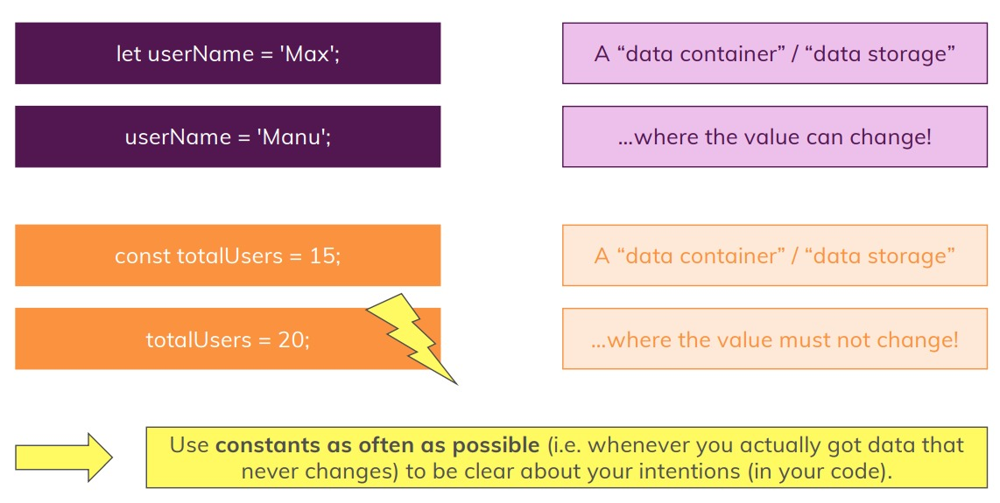
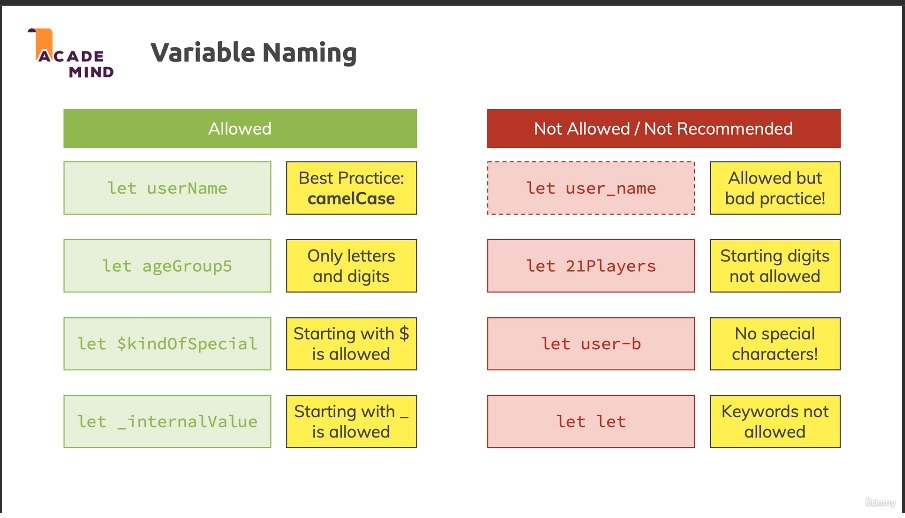
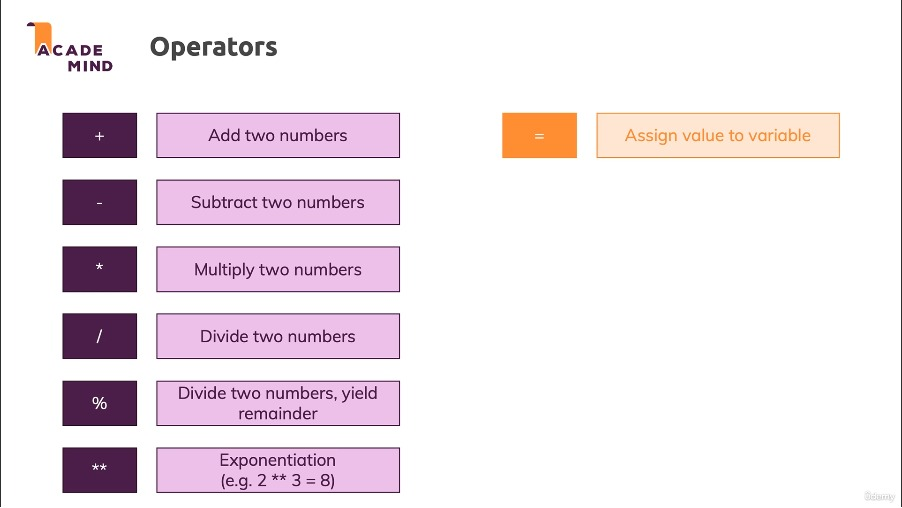
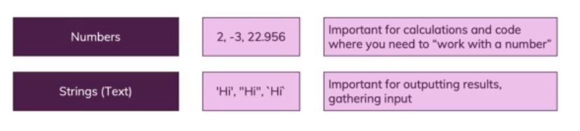

Section 2 : Basics - Variables, Data Types, Operators & Functions
===

## Information
- Title:  `Section 2 : Basics - Variables, Data Types, Operators & Functions`
- Authors:  `Etienne KOA`


## Contenu du module
- Plongez dans la syntaxe de base
- Comprendre les variables et les types de données
- Travailler avec les opérateurs
- Explorer et utiliser les fonctions


## Variables & Constants



## Declaring & Defining Variables






## Data Types : Numbers & Strings (Text)



## Pretrained model
| Model | Download |
| ---     | ---   |
| Model-1 | [download]() |
| Model-2 | [download]() |
| Model-3 | [download]() |


## Directory Hierarchy
```
```
## Code Details
### Tested Platform
- software
  ```
  OS: Debian unstable (May 2021), Ubuntu LTS
  Python: 3.8.5 (anaconda)
  PyTorch: 1.7.1, 1.8.1
  ```
- hardware
  ```
  CPU: Intel Xeon 6226R
  GPU: Nvidia RTX3090 (24GB)
  ```
### Hyper parameters
```
```
## References
- [paper-1]()
- [paper-2]()
- [code-1](https://github.com)
- [code-2](https://github.com)
  
## License

## Citing
If you use xxx,please use the following BibTeX entry.
```
```
